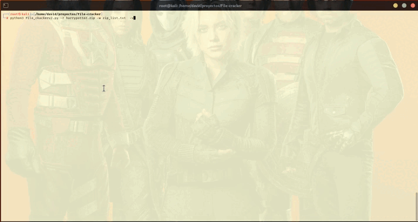

pip install rarfile PyPDF2 tqdm
sudo apt install unrar  # si estás en Kali, Debian, Ubuntu


~ ❯❯❯ git clone https://github.com/Dracos22/File-Cracker.git
~ ❯❯❯ cd File-Cracker/
```


 python File_ckackerv2.py --help

╔══════════════════════════════════════════════════════╗
║                    FILE CRACKER                      ║
╠══════════════════════════════════════════════════════╣
║   > .rar crack      > .zip crack      > .pdf crack   ║
╚══════════════════════════════════════════════════════╝

usage: File_ckackerv2.py [-h] -r RESOURCE -w WORDLIST [-o OUTPUT] [-v] [-H]

File Cracker: Fuerza bruta para ZIP, RAR y PDF protegidos con contraseña.

options:
  -h, --help            show this help message and exit
  -r, --resource RESOURCE
                        Archivo objetivo (zip, rar, pdf).
  -w, --wordlist WORDLIST
                        Archivo de contraseñas.
  -o, --output OUTPUT   Ruta de extracción si se encuentra la contraseña.
  -v, --verbose         Mostrar contraseñas probadas.
  -H, --hash            Mostrar hash SHA256 del archivo.

```
# DEMO
<br>



```
 python3 File_ckackerv2.py -r file.zip -w wordlist.txt  -v   
```
